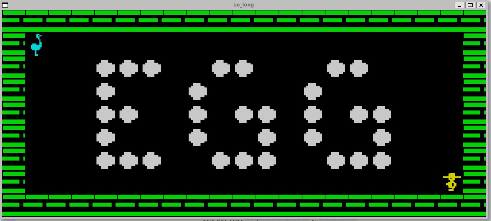

*This project has been created as part of the 42 curriculum by vabatist.*

---

# 🕹️ so_long



<div align="center">
  <p><strong>A retro 2D game inspired by Chuckie Egg, built from scratch in C</strong></p>
  <br>
  
  
  
  
</div>

## Description

**so_long** is a small 2D game developed in **C** using the **MiniLibX** library. The project is a tribute to the 1983 classic **Chuckie Egg** on the **ZX Spectrum**—a game that combines nostalgia with the challenge of navigating a map while collecting items.

### Goal
The objective is to collect all items scattered across the map and reach the exit without touching any walls or obstacles. This project focuses on:

- **Graphics rendering** using 64x64 sprites
- **Custom map parsing** for `.ber` file format
- **Pathfinding algorithms** (Flood Fill) to ensure map validity
- **Event-driven programming** for smooth gameplay
- **Memory efficiency** with zero memory leaks (validated with Valgrind)

### Key Features
- Multiple playable maps with varying difficulty
- Smooth character movement using keyboard input
- Real-time rendering and collision detection
- Strict memory management following 42 coding standards

---

## Instructions

### Compilation

```bash
make
```

The Makefile automatically builds the project and all dependencies (libft and MiniLibX).

### Execution

```bash
./so_long maps/map1.ber
```

Replace `map1.ber` with any of the available maps:
- `maps/map1.ber`
- `maps/map2.ber`
- `maps/map3.ber`

Or create your own `.ber` map file following the format specification.

### Controls

- **W, A, S, D** or **Arrow Keys** — Move the character
- **ESC** — Close the game window

### Cleanup

```bash
make clean    # Remove object files
make fclean   # Remove all generated files
make re       # Rebuild from scratch
```

---

## Resources

### References
- [MiniLibX Documentation](https://github.com/42Paris/minilibx-linux)
- [Flood Fill Algorithm](https://en.wikipedia.org/wiki/Flood_fill)
- [Chuckie Egg - ZX Spectrum Classic](https://www.wikipedia.org/wiki/Chuckie_Egg)
- [My Libft Implementation](https://github.com/VdeVanda/42_LIBFT) — Custom C library

### AI Usage
**Claude AI (Haiku 4.5)** was used for:
- **Debugging**: Identifying compilation errors and permission issues with the MiniLibX build system
- **Code optimization**: Suggesting efficient implementations for memory management and pathfinding algorithms
- **Documentation**: Helping structure this README to meet 42 curriculum standards while preserving code quality

---

## Technical Highlights

### Architecture
- **so_long.c** — Main game loop and initialization
- **map\*.c** — Map parsing, validation, and pathfinding
- **render.c** — Graphics rendering engine
- **input\*.c** — Keyboard event handling
- **error.c** — Error handling and validation messages
- **frees.c** — Memory cleanup to prevent leaks

### Map Format (.ber)
Maps are text files with:
- `P` = Player spawn position
- `E` = Exit
- `C` = Collectible item
- `0` = Empty space
- `1` = Wall

### Quality Standards
- **Compilation**: `-Wall -Wextra -Werror` (no warnings allowed)
- **Memory**: Zero leaks verified with Valgrind
- **Style**: 42 Norm compliant (80-char lines, 4-char indentation, etc.)

---

## Gameplay

Navigate the map, collect all items (C), and reach the exit (E) without hitting walls. The number of moves is displayed in the terminal window.

> 💡 **Pro tip**: Use the Flood Fill algorithm to verify that all collectibles are reachable before attempting a map!

---

*Happy collecting! 🥚*
